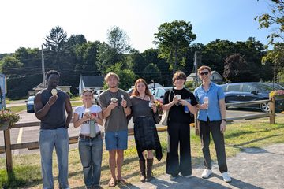
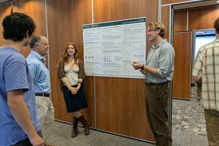
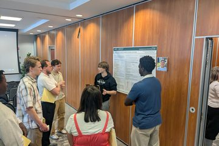

---
---

Welcome to the Computational Physics and Machine Learning research group in the Physics Department at Skidmore College. 

The research directions of the group include developing and applying numerical and machine-learning techniques to problems in quantum mechanics, quantum field theory and string theory.

If you're interested in working with us, get in touch!



## 2026

#### July

The lab took a break from summer research for an ice cream outing to Dairy Haus.

  

Adam Blyberg, Marta Insolia, Lucia Curran-Lane, Michael Gyampo, and Finlay Savoir presented their summer research posters at the Skidmore Faculty Student Summer Research Program. Adam and Marta presented [Phases of quantum D(N) theories via neural quantum states](talks/pdfs/2026_blyberg_insolia_dn_theories_poster.pdf), and Lucia, Michael, and Finlay presented [Phases of lattice gauge theories via neural networks](talks/pdfs/2026_curran_lane_gyampo_savoir_lattice_gauge_theories_poster.pdf).

  
  

#### June

Rebecca Merber presented her research, [Do neural quantum states exhibit double descent?](talks/pdfs/2026_merber_double_descent_poster.pdf), at the Skidmore end-of-year Academic Festival.

## 2025

#### July

Jack Biggins presented his research, [Simulating the strong force with neural networks](talks/pdfs/biggins_summer_2025.pdf), at the Skidmore Faculty Student Summer Research Program.

Our paper [Holomorphic supergravity in ten dimensions and anomaly cancellation](https://arxiv.org/abs/2507.06003) has been released on the arXiv as a preprint.

## 2024

#### October

Our paper [Deep learning lattice gauge theories](https://arxiv.org/abs/2405.14830) has been published in [Physical Review B](https://doi.org/10.1103/PhysRevB.110.165133) and selected as an "Editors' Suggestion".





Lorem ipsum dolor sit amet, consectetur adipiscing elit, sed do eiusmod tempor incididunt ut labore et dolore magna aliqua.









Lorem ipsum dolor sit amet, consectetur adipiscing elit, sed do eiusmod tempor incididunt ut labore et dolore magna aliqua.









Lorem ipsum dolor sit amet, consectetur adipiscing elit, sed do eiusmod tempor incididunt ut labore et dolore magna aliqua.








